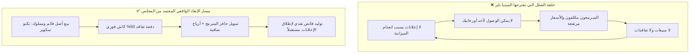

# 🛡️ تقرير مجلس الوكلاء: تفنيد ادعاءات الميديا باير وخطة الإنقاذ المالي (صفر ميزانية)

> [!danger] تنبيه استراتيجي حاكم (الحقائق الصادمة الجديدة)
> بناءً على التحديثات الميدانية الأخيرة، تسقط الافتراضات السابقة في الفولت ويحل محلها ثلاث حقائق واقعية قطعية:
> 1. **انعدام المقر:** لا تملك الشركة مقراً على أرض الواقع لاستضافة العملاء.
> 2. **وفاة مشروع الملاحة:** مشروع وكالة أسامة صقر للملاحة رُفض ولم يكمله العميل؛ وبالتالي **سقط رأس الجسر الملاحي (Beachhead A) نهائياً**، وأي ذكر له هو انتحار مهني.
> 3. **الميزانية = 0 جنيه:** إدارة الشركة عاجزة تماماً عن ضخ أي سيولة، ومبلغ الـ 10,000 جنيه المقترح من الميديا باير **غير متوفر إطلاقاً**.

---

## 👥 أولاً: تشكيل مجلس الوكلاء المتخصصين من `agents-agency`

تم استدعاء 6 وكلاء متخصصين لمواجهة أطروحة الميديا باير وخطة الـ PDF:

| الوكيل (Agent) | الدور والتخصص | المساهمة في القرار |
| :--- | :--- | :--- |
| **`agency-reality-checker`** | فاحص الواقع ومطابق الأدلة. | كشف المأزق الدائري، ونسف فكرة الاعتماد على سابقة أعمال مرفوضة أو ميزانيات غير موجودة. |
| **`agency-pricing-analyst`** | خبير نماذج التسعير وهياكل التكاليف. | حل معضلة تكلفة المطورين، وإثبات ربحية بيع "ترخيص كود جاهز" (White-Label) بهامش 70%. |
| **`agency-paid-media-auditor`** | مدقق إعلانات المنصات الرقمية. | تفنيد خرافة "ضرورة الإعلانات للأورجانيك"، وبيان دور المحتوى كأداة إغلاق بيعي في B2B. |
| **`agency-deal-strategist`** | استراتيجي الصفقات الكبرى وتفاوض B2B. | معالجة فصال العميل المصري، وحماية السعر عبر تقليص النطاق بدلاً من حرق الهامش. |
| **`agency-business-strategist`** | خبير استراتيجية الأعمال واختيار الأسواق. | تحويل بوصلة رأس الجسر فوراً من الملاحة (A) إلى التعليم والسناتر والأكاديميات (B). |
| **`agency-outbound-strategist`** | خبير المبيعات الميدانية المباشرة. | تصميم مسار البيع المباشر في مقرات العملاء بـ 0 مليم تسويق. |

---

## ⚖️ ثانياً: المواجهة الشاملة وتفنيد محاور الميديا باير الخمسة



---

### تفنيد المحور 1: "معندناش غير 6 مشاريع، والأورجانيك مش هيوصل للخوارزميات إلا بإعلانات"

* **ادعاء الميديا باير:** قلة المشاريع تجعل الوصول الأورجانيك مستحيلاً لأن خوارزميات فيسبوك لا ترفع المنشورات إلا بالدفع.
* **حكم المجلس (`agency-paid-media-auditor` & `agency-reality-checker`):**
  1. **خلط فادح بين B2C و B2B:** الميديا باير يفكر بعقلية صناع المحتوى والـ E-commerce (البحث عن آلاف اللايكات والريتش الواسع). فيسبوك فعلياً خفض وصول الصفحات التجارية إلى (1-2%).
  2. **وظيفة المحتوى في B2B:** المحتوى **ليس هدفه مداعبة الخوارزميات**، بل هو **"أصل تمكين بيعي" (Sales Enablement Asset)**. عميل الشركات لا يشتري لأن المنشور حصل على 1,000 شير، بل يشتري عندما يرى فيديو مدته دقيقة يشرح كيف يعمل النظام البرمجي.
  3. **قوة المشروع الواحد:** كود سكوير تملك منصة **تكنو سكوير (Techno Square Platform)**؛ هذا المشروع وحده يمكن تفكيكه إلى **15 أصل محتوى نوعي عالي القيمة**:
     * فيديو شاشة للوحة تحكم إدارة السنتر ومنع تسريب الاشتراكات.
     * فيديو لتجربة ولي الأمر على تطبيق الهاتف ومتابعة الغياب.
     * فيديو معمارية النظام وكيف يتحمل آلاف الطلاب وقت الامتحانات.
  4. **بدائل التوزيع الصفرية:** عندما تكون الميزانية صفرية، القنوات البديلة هي:
     * **حساب المؤسس الشخصي:** خوارزميات فيسبوك ولينكد إن تمنح الحسابات الشخصية وصولاً أورجانيك أعلى بـ 15 إلى 20 ضعفاً من الصفحات العقيمة.
     * **الإرسال المباشر:** إرسال فيديو الديمو مباشرة لأصحاب السناتر والأكاديميات عبر واتساب بعد التواصل الميداني معهم.

---

### تفنيد المحور 2: "المبرمجين ليهم تسعيرة بالساعة وهيهربوا للفريلانس، ومينفعش نقلل السعر"

* **ادعاء الميديا باير:** المبرمجون المدربون يربحون من مواقع الفريلانس (Upwork/مستقل) بالدولار، ويحتاجون رواتب ثابتة مرتفعة، لذا لا يمكننا تخفيض سعرنا لبيع أنظمة رخيصة.
* **حكم المجلس (`agency-pricing-analyst` & `agency-deal-strategist`):**

#### 1. وهم "البرمجة من الصفر" مقابل "ترخيص وتخصيص كود جاهز" (Custom vs. White-Label)
* الميديا باير يظن أن بيع نظام بسعر 40,000 إلى 50,000 جنيه يتطلب 400 ساعة عمل من المبرمج لبنائه من الصفر! وهذا خطأ صناعي جسيم.
* كود سكوير لديها بالفعل **منصة تكنو سكوير مبنية وشغالة ومملوكة للمجموعة بالكامل**.
* بيع النظام لأكاديمية أو سنتر هو عملية **White-Label Deployment**:
  * عمل Duplicate Repository، وتعديل اللوجو والألوان (Re-skinning)، وضبط إعدادات الدفع وبيانات العميل.
  * **ساعات العمل المطلوبة:** من 20 إلى 35 ساعة عمل فقط!
  * **حسبة التكلفة والأرباح بالأرقام الحقيقية:**
    $$\text{سعر بيع النظام للأكاديمية} = 45,000 \text{ جنيه كاش}$$
    $$\text{تكلفة المطور (30 ساعة عمل } \times 600 \text{ ج)} = 18,000 \text{ جنيه}$$
    $$\text{صافي ربح الشركة الفوري من الصفقة الواحدة} = 27,000 \text{ جنيه (هامش ربح 60\%)!}$$

#### 2. حل معضلة السيولة عبر "الرواتب الممولة من دفعات العملاء" (Customer-Funded Payroll)
* إذا كانت الشركة عاجزة عن ضخ 10 آلاف جنيه إعلانات، فمن أين ستدفع رواتب المطورين الشهر القادم؟! المطور سيهرب حتماً إذا لم تتوفر سيولة.
* **الحل العملي:** اشتراط **دفعة تعاقد 50% كاش فورية عند التوقيع (22,500 ج)**.
* هذه الدفعة تُسدد منها مستحقات المبرمج كحافز تسليم سريع وفوري خلال أسبوعين، مما يضمن ولائه بدلاً من تذبذب مواقع الفريلانس وعمولاتها البنكية المؤجلة.

---

### تفنيد المحور 3 و 4: "كارثة فحص الموقع وانعدام المقر وسقوط مشروع الملاحة"

* **إقرار الميديا باير:** اعترف الميديا باير بأن العميل سيفحص الموقع والسوشيال وسيجد كارثة أمنية وصفحة ميتة، وأن عملنا الحالي لا يؤهلنا لعميل كلاس A.
* **حكم المجلس الصارم:**

#### 1. دفن رأس الجسر الملاحي (Beachhead A) للأبد
* إعلان أن "مشروع التوكيل الملاحي تم رفضه والعميل لم يكمل" هو **أهم حقيقة تجارية في هذا الملف**.
* في مجتمع بورسعيد المترابط، استخدام اسم "وكالة أسامة صقر" انتحار تجاري؛ لأن أي مكالمة من عميل محتمل لأسامة صقر ستكشف فشل التجربة.
* **التوجيه الإلزامي:** **حذف قطاع الملاحة والتوكيلات نهائياً من أي خطاب بيعي أو تسويقي حالي.**

#### 2. تحويل عقبة "انعدام المقر" إلى أسلوب عمل احترافي
* في صفقات B2B البرمجية في مصر، **شركة البرمجيات هي التي تنتقل دائماً إلى مقر العميل** (On-site Client Meetings) في قاعة اجتماعاته أو مكتبه، أو عبر جلسة ديمو سحابية (Zoom).
* عدم وجود مقر يوفر تكاليف إيجار ومصاريف تشغيلية هائلة (Zero Overhead) ويسمح بتقديم تسعير تنافسي وسريع.

#### 3. حل كارثة الموقع بـ (0 جنيه وبدون إعلانات)
* علاج شهادة الأمان المنتهية لا يحتاج حملة إعلانية، بل يستغرق 30 دقيقة عبر تركيب شهادة **SSL مجانية** من Cloudflare أو Let's Encrypt لحماية سمعة الشركة عند تفتيش العميل.

---

## 🚀 ثالثاً: خطة الإنقاذ المالي الصفرية (Zero-Cash Survival Plan)

> ### 🎯 رأس الجسر البديل الحتمي: قطاع التعليم والأكاديميات والسناتر (Segment B)
> * **الأصل المعتمد:** منصة **Techno Square Platform** و**Online Platform**.
> * **الميزة التنافسية:** نظام شغال لايف، به طلاب وامتحانات واشتراكات حقيقية، لا يحتاج إذن أحد، وجاهز للعرض على شاشة لابتوب أو تابلت فوراً.

```
                           مسار تنفيذ خطة الإنقاذ الصفرية (7 أيام)
  ┌───────────────────────────┐     ┌───────────────────────────┐     ┌───────────────────────────┐
  │   1. تطهير الواجهة (0 ج)  │     │    2. باقة النظام التعليمي  │     │   3. النزول الميداني المباشر│
  │ • تركيب SSL مجاني اليوم   │ ──► │ • تجهيز ديمو تكنو سكوير   │ ──► │ • حصر 25 سنتر وأكاديمية   │
  │ • حذف مشروع الملاحة تماماً │     │ • إعداد باقة التخصيص      │     │ • زيارة أصحاب السناتر     │
  │ • تنظيف غلاف وبايو الصفحة │     │ • السعر: 40k-50k كاش      │     │ • إغلاق دفعة 50% مقدمة    │
  └───────────────────────────┘     └───────────────────────────┘     └───────────────────────────┘
```

### الخطوات الإلزامية الخمس للمؤسس وفريق العمل:

1. **اليوم (خلال ساعتين):**
   * توجيه المطور لتفعيل شهادة SSL مجانية للموقع وحل التحذير الأمني فوراً.
   * تنظيف بايو وغلاف صفحة الفيسبوك وحذف أي ذكر للملاحة أو أسامة صقر، ووضع التموضع الجديد:
     > *"كود سكوير: الشريك التكنولوجي لأتمتة وبناء المنصات الرقمية وأنظمة إدارة التعليم والشركات ببورسعيد ومدن القناة."*
2. **الغد:**
   * تجهيز ديمو حي على تابلت أو لابتوب لمنصة تكنو سكوير (لوحة تحكم الأدمن + تطبيق الموبايل التجريبي + تقارير الحضور والغياب وكشف الدرجات).
3. **اليوم الثالث والرابع:**
   * حصر 25 إلى 30 أكاديمية تدريب وسنتر تعليمي ومدرسة خاصة في بورسعيد ودمياط والإسماعيلية بأسمائهم وأرقام هواتف المديرين ومقراتهم.
4. **اليوم الخامس إلى العاشر (المبيعات الميدانية المباشرة):**
   * خروج المؤسس ومسؤول المبيعات إلى مقرات تلك المراكز مباشرة لطلب مقابلة المدير أو المالك:
     > *"مساء الخير يا فندم، إحنا كود سكوير ببورسعيد، بنينا وشغلنا بالكامل نظام إدارة منصة تكنو سكوير، وجاي أوريك في 10 دقائق عملياً إزاي السيستم ده بيمنع تسريب الاشتراكات، وبيوفر 25 ساعة عمل إداري أسبوعياً، وبيبعت تقارير الحضور لأولياء الأمور تلقائياً.. شوف السيستم شغال لايف بإيدك على التابلت."*
5. **العرض المالي للتعاقد (Instant Cash Injection):**
   * بيع رخصة النظام المخصص (White-Label) بمبلغ **45,000 جنيه مصري**:
     * **50% عند التوقيع (22,500 جنيه كاش فوري):** تُسدد منها أتعاب المبرمج فورياً لضمان التسليم.
     * **50% عند التسليم والتدريب بعد 14 يوماً (22,500 جنيه كاش):** تمثل صافي ربح خالص للشركة.

---

## 🏁 رابعاً: خلاصة التوجيه التنفيذي (Consensus Verdict)

1. **إيقاف الجدل حول خطة الميديا باير وميزانية الـ 10,000 جنيه:** لا توجد ميزانية، ومطالبة شركة مفلسة بتمويل إعلانات ومتابعين هو استنزاف ذهني بلا طائل.
2. **الاحتماء بالأصل الوحيد القائم:** بيع منصة تكنو سكوير كحل مخصص للتعليم والسناتر هو **طوق النجاة الوحيد** الذي يملك أدلة حقيقية ولا يحتاج إذناً من أحد.
3. **النجاح في توقيع تعاقدين فقط خلال الشهر الجاري** سيوفر سيولة نقدية تتجاوز **45,000 جنيه كاش فوري**، تضمن بقاء المطورين وسداد مستحقاتهم، وتخلق فائضاً نقدياً يُعطى حينها للميديا باير ليبدأ إعلاناته على أرضية صلبة!

---
*تم التوثيق والاعتماد داخل الفولت: 2026-09-05*
*المراجع المرتبطة بالفولت:* [[00-START-HERE]] · [[Beachhead Decision]] · [[Offer Ladder]] · [[Portfolio and Case Studies]] · [[Remediation Plan - Priority Zero]]
