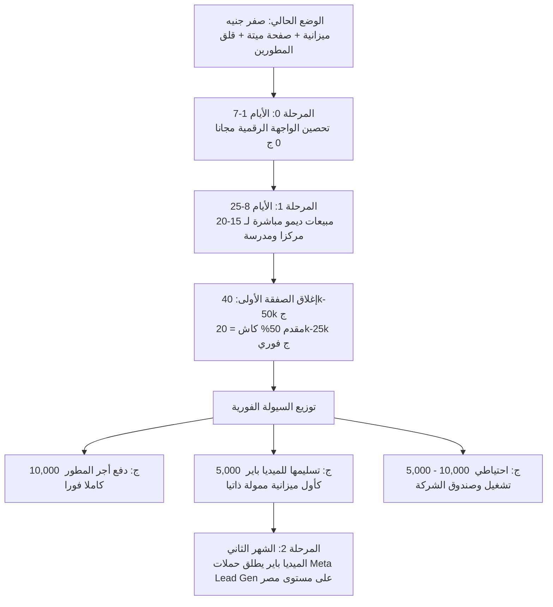

# خطة التوفيق الجدلية وحل أزمة كود سكوير: التوليف بين رؤية الميديا باير ومجلس الوكلاء ورأي كودكس المستقل

**التاريخ:** 05 سبتمبر 2026  
**الجهة:** مجلس استراتيجية كود سكوير (Code Square - M Tech Square Group)  
**الحالة:** وثيقة قرار تنفيذي توافقي ملزمة  

---

## 1. استخلاص أفضل ما عند كل طرف (Best of Both Worlds)

للخروج من الاستقطاب العقيم بين "التسويق الإعلاني المدفوع" و"الاستقطاب الميداني البحت"، تم استخلاص الركائز الذهبية التي أصاب فيها كل طرف كبد الحقيقة:

### أفضل ما عند الميديا باير (واقعية السوق والشارع والمطورين):
1. **تشخيص سيكولوجية العميل المصري بدقة:** العميل المصري (سواء B2C أو B2B) تحركه المظاهر والشكوك. هو بطبعه شكاك؛ وإذا قمت بالتواصل معه مباشرة (Direct Sales)، فأول رد فعل غريزي يقوم به هو فتح الهاتف والبحث عن صفحة وموقع الشركة.
2. **الاعتراف بوفاة الريتش الأورجانيك لخوارزميات فيسبوك:** الصفحات التجارية على ميتا أصبحت تخضع لسياسة "Pay-to-Play". نسبة الوصول المجاني لصفحة تملك 83 متابعاً تكاد تكون 0% إلى 1%. الاعتماد على النشر العادي فقط لتوليد مبيعات هو مضيعة للوقت.
3. **فهم ديناميكيات هروب المبرمجين (Talent Drain):** المبرمج المؤهل لن ينتظر وعوداً مستقبلية في ظل وجود فرص عمل حر دولية تدر دولارات وريالات. إذا لم ير تدفقاً نقدياً ملموساً يضمن أجره الفوري، سيغادر الشركة حتماً.
4. **خطورة انعدام المصداقية التقنية (SSL & Rendering):** لا يمكن إقناع أي عميل بدفع عشرات الآلاف لشركة برمجيات وموقعها يعطي تحذيراً أمنياً أحمر (Expired SSL) ومشاكل في الريندرينج.

### أفضل ما عند مجلس الوكلاء / الفولت (الحصافة المالية وهندسة الأصول):
1. **الانضباط المالي الصارم (Zero-Budget Realism):** لا يمكن إنفاق أموال غير موجودة (0 جنيه). المطالبة بـ 10,000 جنيه شهرياً في ظل عدم وجود سيولة هو انتحار مالي صريح. العمل يبدأ بما نملك، لا بما نتمنى.
2. **استثمار الأصول الجاهزة بدلاً من البرمجة التخصيصية (Productized SaaS vs Custom Dev):** كود سكوير تملك أصلاً جوهرياً جاهزاً ومملوكاً للمجموعة وهو منصة **Techno Square (LMS)**. إعادة تخصيصها وبيعها لعميل جديد (White-Labeling) يتطلب 25-30 ساعة عمل فقط للمطور بمارجن ربح يفوق 70%، بدلاً من الدخول في نفق البرمجة من الصفر التي تستغرق 3 أشهر غير مدفوعة.
3. **هندسة التدفق النقدي الفوري (Cash Flow Acceleration):** فرض دفعة مقدمة 50% كاش عند التوقيع (20,000 إلى 25,000 جنيه من قيمة صفقة تتراوح بين 40k-50k) تحل فوراً أزمة أجور المطورين وتضخ سيولة نقدية طازجة في خزينة الشركة.
4. **واقعية صفقات الـ B2B:** الصفقات الكبيرة للمدارس والمراكز التعليمية لا تُباع بزر "اشتري الآن" عبر إعلانات تيك توك وفيسبوك العشوائية، بل تُغلق عبر عروض توضيحية حية (Live Demos) وشاشات عرض حقيقية في مقر العميل أو عبر مكالمات زووم، مما يُسقط عائق "عدم وجود مقر لكود سكوير".

---

## 2. المناظرة الجدلية الرباعية (The 4-Part Dialectic)

### أولاً: نقد الميديا باير (Critique of the Media Buyer)
1. **فخ الإنفاق الانتحاري (The Spending Trap):** الميديا باير يطالب بميزانية 10,000 جنيه شهرياً وهو يعلم أن الخزينة بها 0 جنيه. هذا التفكير يعطل العمل، لأنه يجعل بدء أي خطوة مشروطاً بضخ رأس مال خارجي غير متاح، مما يعني الشلل التام.
2. **الخلط القاتل بين تسويق الـ B2C ومبيعات الـ B2B:** تعامل الميديا باير مع خدمات كود سكوير بنفس عقلية التجارة الإلكترونية الاستهلاكية (جمع لايكات، وزيادة ريتش، وجلب ترافيك عشوائي). برمجيات المؤسسات لا تحتاج إلى 100,000 متابع غير مهتم، بل تحتاج إلى 10 عملاء مؤهلين ومحددين بالاسم والصفة.
3. **التعامل مع البرمجة كـ Custom Development دائم:** افترض الميديا باير أن كل عملية بيع تعني استنزاف مئات الساعات غير المدفوعة للمطورين، متجاهلاً وجود منصة تكنو سكوير الجاهزة التي تم بناؤها واختبارها بالفعل، والتي تحول دور المطور من البناء المضني إلى التخصيص والتشغيل السريع.

### ثانياً: نقد النفس ومجلس الوكلاء (Self-Critique of Assistant & Council)
1. **المثالية الأكاديمية المفرطة في المبيعات الباردة (Over-Academic Naivety):** افترض مجلس الوكلاء أن المؤسس بمجرد نزوله إلى 20 مدرسة سيغلق الصفقات بسهولة، متجاهلاً أن "دورة المبيعات المؤسسية" في مصر بطيئة، وتخضع للبيروقراطية والمماطلة، وأن النزول الميداني المجرد بدون "أرضية رقمية مسخنة" يواجه مقاومة هائلة.
2. **الاستهانة بحاجز الشك الرقمي في مصر:** أخطأ الوكلاء في افتراض إمكانية تأجيل إصلاح وتنشيط الواجهة الرقمية. العميل المصري حين تجلس معه في مكتبه لعرض منصة بـ 45 ألف جنيه، أول حركة يقوم بها بعد خروجك هي كتابة اسم شركتك على جوجل وفيسبوك؛ فإذا وجد صفحة ميتة وموقعاً محظوراً أمنياً، فإن الصفقة تسقط فوراً بدافع الخوف من النصب.
3. **افتراض مرونة مطلقة للمطورين:** الوكلاء نظروا إلى المطورين كأرقام وساعات عمل (25 ساعة)، وتجاهلوا الضغط النفسي الذي يعيشه مبرمج يرى أمامه عقود عمل حر جاهزة على Upwork ومستقل بالدولار، مما يتطلب إعطاءه ضمانات نقدية واضحة ومقدمة قبل أن يلمس سطراً واحداً من الكود.

### ثالثاً: الدفاع عن الميديا باير (Defense of the Media Buyer)
1. **حقيقة صلبة:** هو محق تماماً في أن العميل المصري لا يرحم الكيانات التي تبدو "تحت الإنشاء". الصفحة المهجورة والموقع المعطل هي بمثابة شهادة وفاة تجارية لأي محاولة بيع، وتجعل كل جهود المبيعات الميدانية تصطدم بحائط صد نفسي سميك.
2. **واقع الخوارزميات:** الميديا باير لم يكذب حين أعلن موت الريتش الأورجانيك. الاعتماد على منشورات فيسبوك المجانية في عام 2026 لجلب مبيعات هو وهم تقني يبيعه الهواة؛ المنصات أصبحت شركات إعلانية محضة تخنق الوصول المجاني عمداً لإجبار الشركات على الدفع.
3. **حماية الفريق البرمجي:** دفاعه عن أجور المطورين دفاع مشروع وضروري لبقاء الشركة؛ فخسارة الفريق البرمجي تعني نهاية كود سكوير ككيان تقني، وضمان تدفق دخل حقيقي لهم بالجنيه المصري هو صمام الأمان الوحيد لمنع هجرتهم نحو الفريلانسينج الدولي.

### رابعاً: الدفاع عن النفس ومجلس الوكلاء (Defense of Assistant & Council)
1. **حتمية الواقع الرياضي:** الوكلاء لم يرفضوا الإعلانات الممولة كرهاً فيها، بل لأن الخزينة بها "صفر جنيه". الدفاع الأساسي للوكلاء هو: "من أين نأتي بالـ 10,000 جنيه؟" لا يمكن البدء بإعلان ممول إلا إذا تم تمويله ذاتياً من الإيراد الأول؛ والبدء بالإعلانات دون ميزانية هو هروب من مواجهة الواقع.
2. **قوة أصل الـ SaaS المملوك (Techno Square):** دفاع الوكلاء يستند إلى حقيقة مادية ملموسة: الشركة لا تبدأ من الصفر، بل تملك منصة LMS كاملة ومبنية وشغالة (بث مباشر، اختبارات، تصحيح تلقائي، لوحة تحكم). بيعها كـ White-Label يحقق ربحاً صافياً استثنائياً، ويجعل الـ 25 ساعة عملاً مدفوعاً بامتياز للمطور.
3. **صفرية تكلفة الحلول التقنية المبدئية:** إصلاح شهادة SSL عبر Cloudflare و Let's Encrypt مجاني 100% ولا يحتاج سوى 30 دقيقة من مطور السيرفرات. وتنظيف صفحة الفيسبوك ونشر تسجيلات شاشة وفيديوهات ديمو للمنصة لا يكلف قرشاً واحداً.

---

## 3. الحل التوافقي النهائي المدمج (The Reconciled Hybrid Solution)

يقوم هذا الحل على جسر الهوة عبر خطة إنقاذ وتمويل ذاتي متدرجة على مرحلتين (Phase 0 و Phase 1 و Phase 2)، تجمع بين تكتيكات الميديا باير لحماية المصداقية وتكتيكات الوكلاء لتحقيق السيولة السريعة:

### تفاصيل المراحل التنفيذية:

### المرحلة 0: تحصين الواجهة الرقمية والمصداقية (الأيام 1 إلى 7 - التكلفة: 0 جنيه)
*الهدف: إزالة أي سبب يجعل العميل يشك في مصداقية الشركة قبل بدء التواصل معه.*
1. **إصلاح SSL وموقع الشركة مجاناً (أولوية قصوى):** تفعيل شهادة SSL مجانية عبر Cloudflare أو Let's Encrypt لحذف شاشة التحذير الأمنية الحمراء فوراً، وتحسين سرعة تحميل الموقع.
2. **إعادة تكييف وتأهيل صفحة الفيسبوك (Digital Facelift):**
   - إيقاف نشر البوستات العامة والنصائح المستهلكة.
   - نشر 3-4 مقاطع فيديو عالية الجودة مسجلة من الشاشة (Screen Recordings) تعرض منصة **Techno Square** الحية أثناء العمل (استعراض بنك الأسئلة، نظام منع الغش، البث المباشر، وتطبيق ولي الأمر).
   - تثبيت منشور رئيسي (Pinned Post) يعلن عن: *"عرض كود سكوير لدعم المؤسسات التعليمية والمدرسين: منصتك التعليمية المتكاملة بهويتك الخاصة وتسليم خلال 72 ساعة"*.
3. **تجهيز حساب المؤسس الشخصي على لينكد إن وفيسبوك:** ليعمل كـ "وجه موثوق للشركة" أثناء التحرك في بورسعيد ومدن القناة.

### المرحلة 1: مبيعات الديمو المباشر وتأمين السيولة (الأيام 8 إلى 25 - التكلفة: 0 جنيه)
*الهدف: إغلاق صفقة أو صفقتين وتوفير 20k إلى 50k جنيه كاش لإنقاذ المطورين وتمويل التسويق.*
1. **حصر الأهداف (Target List):** حصر 20 هدفاً مؤكداً في بورسعيد والإسماعيلية (مراكز دروس خصوصية كبرى، مدارس خاصة، أشهر 5 مدرسين ثانوي لديهم آلاف الطلاب).
2. **تنفيذ العروض الحية (Live Interactive Demos):** عقد لقاءات شخصية في مقرات العملاء أو مكالمات عبر الشاشة؛ تقديم ديمو تفاعلي مباشر للمنصة الشغالة على لابتوب المؤسس مع منحهم تجربة حية على هواتفهم.
3. **تسعير الـ White-Label مع شرط المقدم الحاسم:**
   - السعر: 40,000 إلى 45,000 جنيه (أقل من سعر السوق الذي يطلبه مبرمجو القاهرة بـ 80k-100k).
   - شرط التعاقد: **دفعة مقدمة 50% كاش عند توقيع العقد (20,000 إلى 22,500 جنيه)**.
4. **توزيع الكاش المحصل فورياً:**
   - **40% إلى 50% (حوالي 10,000 جنيه):** تُدفع نقداً وفوراً للمطور المسؤول عن تسليم نسخة الـ White-label (تغطي 25 ساعة عمل بسعر ساعة تنافسي للغاية يضاهي الفريلانسينج ويضمن ولاءه).
   - **20% إلى 25% (حوالي 5,000 جنيه):** توضع مباشرة في حساب إعلانات الميديا باير كأول ميزانية إعلانية حقيقية وممولة ذاتياً.
   - **الباقي:** احتياطي تشغيلي وصندوق سيولة لكود سكوير.

### المرحلة 2: تمكين الميديا باير وتوسيع النطاق (الشهر الثاني - ميزانية ممولة ذاتياً)
*الهدف: تسليم الدفة للميديا باير للتوسع بحملات ممولة خارج بورسعيد.*
1. أخذ الـ 5,000 إلى 10,000 جنيه التي تولدت من أرباح الصفقة الأولى وإطلاق حملات Meta Lead Generation (Instant Forms) موجهة للمدارس والأكاديميات والمدرسين في الدلتا والقاهرة والإسكندرية.
2. استخدام أول عميل تم إغلاقه في المرحلة الأولى كـ "قصة نجاح حية" (Case Study) وفيديو شهادة عميل (Testimonial)، مما يرفع معدل تحويل الإعلانات الممولة بنسبة تفوق 300%.

---

## 4. تقرير ورأي كودكس المستقل (Codex Independent Audit & Verdict)

تم استدعاء وكيل **Codex** عبر أمر `/codex-delegate` لتقديم تدقيق تجاري وتنفيذي محايد وصارم (Adversarial Review) للطرفين وللخطة التوافقية، وجاء تقريره حاسماً كما يلي:

### ملخص حكم كودكس التنفيذي (Executive Verdict):
> **"الميديا باير محق تماماً في تحذيره من كارثة انعدام المصداقية وخطر هروب المطورين، لكن حله المقترح مستحيل مالياً؛ فالمطالبة بإنفاق 10,000 جنيه شهرياً في ظل وجود صفر جنيه كاش ليست استراتيجية بل طلباً غير ممول. في المقابل، يمتلك مجلس الوكلاء الموقف الأقوى من حيث المبدأ (إصلاح المصداقية، بيع أصل موجود، تحصيل الكاش مسبقاً، ثم تمويل التسويق من الأرباح)، إلا أن توقعات الوكلاء مفرطة في التفاؤل؛ فحصر 15-20 عميلاً لن يولد صفقة أو صفقتين مدفوعتين خلال 18 يوماً كقاعدة موثوقة، وتقدير 25-30 ساعة لتخصيص المنصة هو مجرد فرضية نظرية لم تُختبر عملياً بعد."**

---

### نقد كودكس التفصيلي للطرفين:

#### 1. أين أصاب الميديا باير وأين ارتكب أخطاء كارثية؟
* **أين أصاب:**
  - الانهيار الرقمي الحالي (SSL منتهي + صفحة ميتة) هو بمثابة رصاصة في قلب أي محاولة بيع، والعميل المصري سيقوم حتماً بالتحري غير الرسمي (Due Diligence).
  - خوارزميات ميتا تحد من الوصول المجاني للمنشورات؛ لذا فالنشر العادي المجرد ليس نظاماً معتمداً لتوليد الصفقات.
  - المطورون أصحاب الكفاءة لن يدعموا الشركة بأعمال تأملية غير مدفوعة في ظل وجود بدائل دولية بالدولار.
* **أين أخطأ الميديا باير خطأً فادحاً:**
  - **اقتراح إنفاق أموال غير موجودة:** عندما تكون الميزانية صفر، فإن نقاش جدوى الـ 10,000 جنيه يصبح عبثاً حسابياً.
  - **الخلط بين 3 أهداف تسويقية مختلفة:** خلط بين (بناء المصداقية)، و(تجميع المتابعين)، و(توليد فرص بيعية مؤهلة B2B). شراء المتابعين قد يحسن المظهر الخارجي ولكنه لن يجلب مديراً يوقع شيكاً بـ 50 ألف جنيه.
  - **غياب الحسابات الاقتصادية:** لم يقدم أي نموذج لاقتصاديات الحملة (تكلفة العميل المحتمل CPL، نسبة التحويل لديمو، نسبة الإغلاق، والقيمة الدائمة LTV).
  - **توجيه إعلانات مدفوعة لواجهة منهارة:** إرسال ترافيك ممول لموقع ببطء فادح وشهادة SSL مكسورة هو حرق مضاعف وسريع للأموال.

#### 2. أين أصاب مجلس الوكلاء وأين وقع في السذاجة الأكاديمية؟
* **أين أصاب:**
  - احترم القيد المالي الحاكم (الإنقاذ يبدأ بجمع الكاش أولاً قبل الإنفاق).
  - فضّل بيع أصل برمجيات جاهز وشغال (Techno Square LMS) بدلاً من الانجرار خلف البرمجة التخصيصية المرهقة.
  - ألزم المبيعات المباشرة بالدفعات المقدمة لحماية التدفق النقدي.
* **أين وقع الوكلاء في السذاجة (Naive Assumptions):**
  - **افتراض إغلاق 1-2 صفقة من 15-20 عميلاً خلال 18 يوماً هو تفاؤل غير واقعي.** في سوق المؤسسات المصري، هذا التحويل (5% إلى 13%) يحتاج إلى علاقات سابقة متينة. الواقع يتطلب: **(40-60 جهة مستهدفة $\rightarrow$ 25-35 محادثة مع صاحب القرار $\rightarrow$ 8-12 ديمو حقيقي $\rightarrow$ 3-5 عروض أسعار $\rightarrow$ صفقة واحدة موقعة ومحصلة)**.
  - **فترة الـ 18 يوماً قصيرة جداً للمدارس الخاصة:** المدارس تملك لجان شراء وبيروقراطية بطيئة ومواسم محددة. الهدف الأول يجب أن يكون **المراكز التعليمية والأكاديميات والمدرسين المستقلين الذين يملكهم شخص واحد يتخذ القرار فوراً في الجلسة**.
  - **فرضية الـ 25-30 ساعة تخصيص غير مجربة عملياً:** تحويل المنصة لعميل جديد قد يفجر أعباء غير مرئية (عزل البيانات Tenant Isolation، بوابة الدفع، استيراد بيانات الطلاب، مشاكل الواجهة العربية، التدريب والدعم الفني).
  - **عدم وضوح العقد الداخلي:** يجب حسم حقوق ملكية وترخيص المنصة داخل مجموعة M Tech Square رسمياً قبل الخروج لبيعها.
  - **تأمين أجور المطورين:** استلام الدفعة المقدمة لا يعني تلقائياً حماية المطورين إلا إذا تم "تسييج وعزل" حصة المطور (Ring-fencing) ومنع الصرف منها على أي بند آخر حتى يستلم عمله.

---

### نقاط الفشل الحرجة في الخطة التوافقية وتحصينها (Stress-Test):
1. **نقطة الفشل 1 (غياب مالك صريح للمبيعات):** الاعتماد على "المبيعات المباشرة" قد يتحول لمجرد ملف إكسل ورسائل واتساب لا يرد عليها أحد. **الحل:** يجب أن يقود المؤسس شخصياً يومياً الاتصالات والمقابلات الميدانية.
2. **نقطة الفشل 2 (اتساع العرض وتورط المطورين):** تقديم "منصة حسب الطلب" سيدمر اقتصاديات الشركة. **الحل:** بيع "باقة قياسية ثابتة Configuration" وليس "Custom Development". أي تعديل إضافي يُسعر ويُدفع مقدماً بالساعة.
3. **نقطة الفشل 3 (مقاومة العميل لمقدم 50% كاش):** بعض العملاء سيرفضون دفع 50% مقدماً قبل رؤية شيء. **هندسة الدفعات البديلة:**
   - 10% رسوم إعداد غير مستردة (Onboarding).
   - 40% قبل بدء التخصيص والربط.
   - 30% عند فحص واختبار المنصة على بيئة تجريبية (Staging).
   - 20% قبل إطلاق النطاق والتشغيل الحي الرسمي (Production Launch).
4. **نقطة الفشل 4 (حرق أموال الصفقة الأولى في الإعلانات):** إغلاق صفقة واحدة لا يعني أن إعلانات ميتا ستنجح تلقائياً. **الحل:** البدء باختبار إعلاني مقيد ومحسوب (Capped Test) يربط أداء الميديا باير بعدد الديموهات المحجوزة وليس بعدد اللايكات والمتابعين.

---

## 5. خطة العمل التنفيذية المعتمدة لهذا الأسبوع (The 4 Weekly Directives)

بناءً على التوليف الجدلي وتدقيق كودكس، هذه هي المهام الأربع غير القابلة للتأجيل:

| # | المهمة التنفيذية | المسؤول | المدى الزمني | مخرجات التحقق |
|---|---|---|---|---|
| **1** | **إصلاح واجهة الثقة الرقمية (Trust Surface)** | الفريق التقني والمؤسس | 72 ساعة | - تفعيل SSL مجاناً وحذف التحذير الأمني. - نشر 3 فيديوهات حقيقية لشاشات منصة Techno Square على فيسبوك ولينكد إن. - توضيح الهوية الرسمية للشركة ومجموعة M Tech Square. |
| **2** | **تحويل المنصة لمنتج قياسي (Customer Zero Test)** | كبير المطورين | 4 أيام | - تنفيذ محاكاة تشغيل وهمية لأكاديمية جديدة. - حساب ساعات التخصيص الحقيقية بدقة وتجهيز قائمة استثناءات صريحة تمنع الـ Scope Creep. |
| **3** | **إطلاق سباق المبيعات لـ 50 جهة (50-Account Sprint)** | المؤسس شخصياً | الأسبوع 1 و 2 | - استهداف 50 مركزاً وأكاديمية ومدرساً مشهوراً في بورسعيد والقناة. - إجراء 30 محادثة حقيقية $\rightarrow$ حجز 8 ديموهات حية $\rightarrow$ تقديم 3 عروض رسمية. |
| **4** | **تسييج وحماية السيولة النقدية (Cash Ring-Fencing)** | الإدارة المالية والمؤسس | فوري | - عزل 40-50% من أي دفعة مقدمة لصالح المطور المسؤول فوراً. - منع صرف أي مليم على الإعلانات إلا بعد تسليم الصفقة وتغطية تكاليف الخوادم والمطورين بالكامل. |

---
**الخلاصة:** المعركة ليست "إعلانات ضد مبيعات مباشرة"، بل هي: **هل تستطيع كود سكوير تحويل منتج تقني جاهز إلى سيولة نقدية محصلة ومحمية تدفع أجور المطورين أولاً؟** الإجابة تبدأ بإصلاح الواجهة خلال 72 ساعة، وتشغيل المنصة كمنتج محدد، وقيادة المبيعات على الأرض. وعندما تتحقق أول أرباح، تصبح الإعلانات الممولة سلاحاً للتوسع وليست مقامرة بالبقاء.

