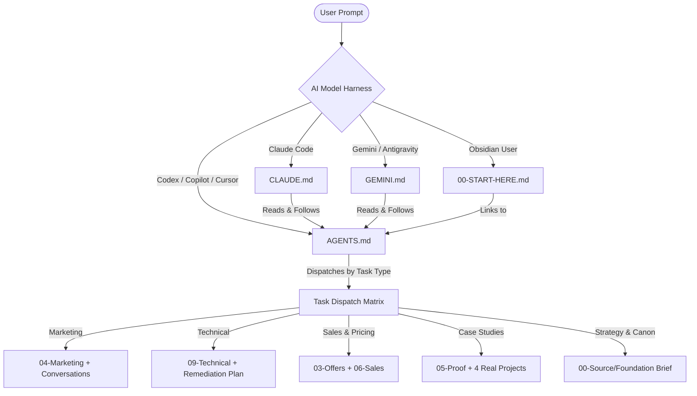

# Design: Unified AI Landing & Operations Guide for Code Square Vault

## 1. Objective & Background

Code Square (`CS`) is an IT/software company in Port Said, Egypt, operating within the M Tech Square group. Its operational brain is stored in this Obsidian vault (`d:\vault\code-square`). 
Multiple AI coding and reasoning systems interact with this vault:
- **Claude / Claude Code**
- **OpenAI Codex / GitHub Copilot / Cursor**
- **Google Gemini / Antigravity**

The goal is to create a comprehensive, authoritative, bilingual (English technical rules + Arabic domain terms/quotes) landing document (`AGENTS.md`) and harness configurations (`CLAUDE.md`, `GEMINI.md`, and an updated `00-START-HERE.md`) that allow any AI model landing on this repository to immediately understand:
1. **The Company & Founder Persona**: Port Said B2B software company; founder is a pharmacist; no jargon, direct consequence-first communication.
2. **The Inviolable Truth Hierarchy & Guardrails**: 
   - `00-Source/` is immutable historical evidence.
   - `Foundation Brief.md` is canonical strategy.
   - Anti-fabrication rules: only 4 documented real projects (2 internal, 2 external), never invent numbers, prices, or credentials.
   - Banned phrases ("أقوى فريق", "حلول متكاملة", "Awwwards-tier", etc.).
3. **The Vault Topology & Hidden Alleys ("دهاليز الفولت")**: Exhaustive mapping of all folders (`00-Source` to `10-Group`), strategic conversations (e.g. Media buyer vs. Agents debates in `Conversations/`), daily logs, and visual assets.
4. **Task-Specific Dispatch Engine**: Concrete runbooks routing the agent to the right notes depending on whether the task is marketing, technical remediation, sales copy, case study drafting, or operations.
5. **Execution Standards**: Read before edit, minimal file creation, atomic commits, and verification.

---

## 2. File & Component Architecture

```
d:\vault\code-square\
├── AGENTS.md                 # [NEW] Canonical universal AI Landing & System Guide
├── CLAUDE.md                 # [MODIFY] Streamlined Claude Code configuration delegating to AGENTS.md
├── GEMINI.md                 # [NEW] Gemini / Antigravity configuration delegating to AGENTS.md
├── 00-START-HERE.md          # [MODIFY] Add prominent AI Landing cross-link [[AGENTS]]
└── docs/superpowers/specs/   # Superpowers specifications directory
```

### Component Details

#### 1. `AGENTS.md` (The Core Engine)
- **Format**: Markdown with YAML frontmatter.
- **Language**: English for technical directives and harness rules; verbatim Arabic for Egyptian market terms, founder quotes, and banned phrases.
- **Sections**:
  1. `0. Quick Start for Any AI Agent` (The 30-second primer: Who, What, Golden Rule).
  2. `1. Who is Code Square & Who is the Founder` (Company profile, Port Said context, pharmacist persona, communication rules).
  3. `2. The Inviolable Truth Hierarchy` (`00-Source` immutable, `Foundation Brief` canonical, derived notes).
  4. `3. Strict Guardrails & Anti-Fabrication` (Only 4 real projects: M Tech Square Website, Techno Square Platform, El Shoush Travel System, Osama Sakr Manning Agency; confidence labels: `stated`, `verified`, `researched`, `proposed`, `TBD`; banned phrases).
  5. `4. The Vault Map ("دهاليز الفولت")` (Complete folder breakdown from `00` to `10`, plus `Conversations/`, `Logs/`, `docs/superpowers/`, and `Code Square visual assets/`).
  6. `5. Task Dispatch Matrix (What to do when asked...)`:
     - Task A: Marketing / Ads / Social Media
     - Task B: Technical Audit & Web Remediation
     - Task C: Sales / Offers / Pricing
     - Task D: Proof / Portfolio / Case Studies
     - Task E: Strategy / Ops / Open Questions
  7. `6. Agent Operating Protocol & Multi-Agent Rules` (Read before edit, file creation restrictions, updating logs & index, commit hygiene).

#### 2. `CLAUDE.md` (Claude Code Integration)
- Replaces generic Ruflo template with a crisp pointer to `AGENTS.md`.
- Retains Claude Code specific capabilities, CLI rules, and tool preferences.

#### 3. `GEMINI.md` (Gemini & Antigravity Integration)
- Directs Gemini and Antigravity to ingest `AGENTS.md`.
- Sets guidelines for Superpowers skills, Planning Mode, and artifact creation.

#### 4. `00-START-HERE.md` (Obsidian Integration)
- Adds a direct pointer to `[[AGENTS]]` in the header / introduction section for seamless navigation in Obsidian reading view and graph view.

---

## 3. Data & Flow Sequence



---

## 4. Verification & Testing

1. **Syntax & Link Validity**:
   - Check all internal `[[Wikilinks]]` and relative file paths against existing folders and files in `d:\vault\code-square`.
2. **Model Dry-Runs**:
   - Test that Claude, Codex, and Gemini instructions contain zero conflicting rules.
   - Verify anti-fabrication rules and project lists match `00-Source/Foundation Brief.md` and `_CLAUDE.md`.
3. **Git Hygiene**:
   - Stage, commit, and push cleanly to `origin/main`.
